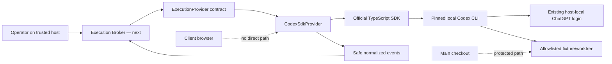

# AI-003 Codex owner-local feasibility packet

Status: `harness proven and merged; integration active`, 2026-07-18. The
harness entered `main` through
[PR #4](https://github.com/Mr-Span/AIdeas/pull/4) at merge commit `ec869ff` after
clean-checkout CI passed. This packet freezes
the first executable provider boundary. It does not mark AI-003 complete: the
durable broker, worktree supervisor, and project research route remain next.

## Priority and scope

AI-003 is the sole active implementation front. Two unrelated release gates are
explicit backlog:

- BL-001: secured LAN client identity and transport;
- BL-002: final purge, residual-audit, backup-lag, and early-deletion semantics.

LAN and automatic purge remain disabled. Neither blocks trusted-host provider
feasibility.

## Verified local and official baseline

Verified on the target Windows host on 2026-07-18:

- system Codex CLI: `0.145.0-alpha.18`;
- `codex login status`: authenticated through ChatGPT;
- official `@openai/codex-sdk`: pinned to `0.144.5`;
- the SDK wraps its pinned Codex CLI and exchanges structured JSONL events;
- official TypeScript SDK guidance covers server-side application/workflow use;
- `codex exec --json` is a stable non-interactive surface;
- App Server is experimental and is not in the critical path.

Official sources:

- [Codex SDK](https://learn.chatgpt.com/docs/codex-sdk)
- [Non-interactive mode](https://learn.chatgpt.com/docs/non-interactive-mode)
- [Authentication](https://learn.chatgpt.com/docs/auth)
- [Developer commands](https://learn.chatgpt.com/docs/developer-commands?surface=cli)

## Executable boundary



The browser never receives the SDK, CLI process, auth store, process environment,
raw provider event, command text/output, reasoning, MCP arguments, or host path.

## Frozen feasibility contract

`ExecutionStart` contains:

- internal UUID `runId`;
- canonical workspace path selected by the broker, never by a client;
- compiled prompt and optional JSON output schema;
- bounded timeout from 1 second to 30 minutes;
- explicit sandbox, network, web-search, and approval grant.

The first grant supports only:

```text
sandboxMode: read-only | workspace-write
networkAccess: true | false
webSearch: disabled | cached | live
approvalPolicy: never
```

The provider emits only normalized `started`, `message`, `tool`, `usage`,
`blocked`, `completed`, and `failed` events. Tool events expose a safe category
and lifecycle state, not command strings, output, queries, MCP arguments, or
provider-specific payloads. Reasoning items are dropped.

## Security controls implemented in the harness

- owner-local execution is disabled unless explicitly enabled by trusted server
  configuration;
- only real Git repositories/worktrees inside an allowlisted root are accepted;
- the main checkout or another protected checkout is rejected;
- Codex receives an allowlisted environment; provider/API keys, access tokens,
  and unrelated process variables are not inherited;
- SDK config overrides disable lifecycle hooks and configured MCP servers for
  the harness; fixture repositories containing a project `.codex` directory are
  rejected pending a dedicated config-policy review;
- exact canaries and common key/bearer/JWT shapes are redacted before output is
  bounded, hashed, or returned;
- SDK `AbortSignal` implements cancel and timeout;
- approval policy is fixed to `never`; permissions come only from the sandbox
  grant;
- result text is bounded and linked to a SHA-256 digest;
- duplicate internal run IDs are blocked;
- error output is classified into stable safe codes rather than returned raw.

## Real feasibility evidence

The live suite `pnpm.cmd test:ai003:live` ran two real Codex turns through the
existing ChatGPT login in a temporary synthetic Git repository:

1. structured read-only analysis with JSON Schema, network and web search off;
2. cancellation immediately after the real `thread.started` event.

Both passed. Before and after each run, Git status stayed clean and the fixture
README digest was unchanged. The canary did not appear in normalized events.
The main AIdeas checkout was a forbidden workspace and was not passed to Codex.

Contract/integration coverage (14 focused tests) also proves timeout, duplicate-run rejection,
disabled-by-default behavior, workspace escape blocking, event normalization,
reasoning/command-output suppression, secret redaction, and safe environment
construction without consuming provider runs.

## Failure map

| Condition | Stable outcome | Retry |
|---|---|---|
| no local login | `auth_required` | after operator login |
| rate or quota | `rate_limited` | bounded/backoff |
| provider/network outage | `provider_unavailable` | bounded/backoff |
| timeout | `timeout` | policy decision |
| operator cancel | `cancelled` | no automatic retry |
| outside allowlisted root | `invalid_workspace` | never |
| repeated internal run ID | `duplicate_run` | never |
| unsupported JSONL/protocol | `provider_protocol` | after compatibility review |
| other provider failure | `provider_error` | manual classification |

## Honest limitations after this spike

1. Run state is in-memory inside the adapter. SDK threads can be resumed, but
   AIdeas does not yet persist the run ledger/provider thread ID in SQLite or
   reconcile an active run after Control Service restart.
2. AbortSignal cancellation passed against a real Codex turn. Windows descendant
   process-tree cleanup and crash-at-boundary fault injection are not yet proven.
3. `codex exec --json` was verified as installed/stable but the recovery adapter
   and compatibility fixture are not implemented yet.
4. No project API or UI can start research. The visible Research step correctly
   remains blocked; the live run is a feasibility receipt, not a client result.
5. Usage events contain provider-reported tokens only. AIdeas does not invent a
   monetary cost when the provider does not report one.
6. This personal ChatGPT session is valid only on the trusted owner host. It is
   never a client login or a multi-user product credential.
7. SDK threads are persisted in Codex's provider-managed local session store so
   they can be resumed. The harness proves AIdeas event redaction, not erasure of
   the prompt from Codex/OpenAI-managed session history; client disclosure,
   provider retention, and ephemeral-run policy must be explicit before real
   client material is sent.

## Remaining AI-003 work packets

### AI003-B — Durable Execution Broker

- migrations for run, event, provider-thread, and terminal receipt records;
- one-writer commands around provider events;
- startup reconciliation of `running`/`cancelling` runs;
- inspect after restart and explicit resume proposal;
- output stored through Artifact Store, not a raw SQLite blob.

### AI003-C — Workspace and recovery supervisor

- external Git worktree lifecycle with protected-main proof;
- process-tree timeout/cleanup and crash injection on Windows;
- stable `codex exec --json` recovery/diagnostic adapter;
- SDK/CLI compatibility contract and version gate.

### AI003-D — Operator-only project research route

- compile an approved project revision into a bounded prompt/context packet;
- start only after durable capture and policy checks;
- persist safe events and research proposal artifacts;
- move Research to `in_progress` only after a real start receipt;
- preserve client-safe projection and keep client initiation disabled.

AI-003 closes only after B, C, and D pass focused security, restart, and browser
truthfulness gates. AI-004 then owns specialized multi-role web research and
human clarification rounds.
