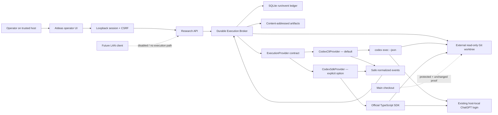

# AI-003 Codex owner-local feasibility packet

Status: `implementation complete; PR #7 CI green`, 2026-07-20. The original
harness entered `main` through
[PR #4](https://github.com/Mr-Span/AIdeas/pull/4). The completed slice now adds
the durable broker, external worktree/process supervision, version-gated CLI
adapter, operator-only project route, and the first real research-result UI.
The completed slice is published as
[PR #7](https://github.com/Mr-Span/AIdeas/pull/7).

## Priority and scope

AI-003 is the sole active implementation front. Two unrelated release gates are
explicit backlog:

- BL-001: secured LAN client identity and transport;
- BL-002: final purge, residual-audit, backup-lag, and early-deletion semantics.

LAN and automatic purge remain disabled. Neither blocks trusted-host provider
feasibility.

## Verified local and official baseline

Verified on the target Windows host on 2026-07-18:

- system Codex CLI: `0.145.0-alpha.18`;
- `codex login status`: authenticated through ChatGPT;
- official `@openai/codex-sdk`: pinned to `0.144.5`;
- the SDK wraps its pinned Codex CLI and exchanges structured JSONL events;
- official TypeScript SDK guidance covers server-side application/workflow use;
- `codex exec --json` is a stable non-interactive surface;
- App Server is experimental and is not in the critical path.

Official sources:

- [Codex SDK](https://learn.chatgpt.com/docs/codex-sdk)
- [Non-interactive mode](https://learn.chatgpt.com/docs/non-interactive-mode)
- [Authentication](https://learn.chatgpt.com/docs/auth)
- [Developer commands](https://learn.chatgpt.com/docs/developer-commands?surface=cli)

## Executable boundary



The browser never receives the SDK, CLI process, auth store, process environment,
raw provider event, command text/output, reasoning, MCP arguments, or host path.

## Frozen feasibility contract

`ExecutionStart` contains:

- internal UUID `runId`;
- canonical workspace path selected by the broker, never by a client;
- compiled prompt and optional JSON output schema;
- bounded timeout from 1 second to 30 minutes;
- explicit sandbox, network, web-search, and approval grant.

The first grant supports only:

```text
sandboxMode: read-only | workspace-write
networkAccess: true | false
webSearch: disabled | cached | live
approvalPolicy: never
```

The provider emits only normalized `started`, `message`, `tool`, `usage`,
`blocked`, `completed`, and `failed` events. Tool events expose a safe category
and lifecycle state, not command strings, output, queries, MCP arguments, or
provider-specific payloads. Reasoning items are dropped.

## Security controls implemented in the harness

- owner-local execution is disabled unless explicitly enabled by trusted server
  configuration;
- only real Git repositories/worktrees inside an allowlisted root are accepted;
- the main checkout or another protected checkout is rejected;
- Codex receives an allowlisted environment; provider/API keys, access tokens,
  and unrelated process variables are not inherited;
- SDK config overrides disable lifecycle hooks and configured MCP servers for
  the harness; fixture repositories containing a project `.codex` directory are
  rejected pending a dedicated config-policy review;
- exact canaries and common key/bearer/JWT shapes are redacted before output is
  bounded, hashed, or returned;
- SDK `AbortSignal` implements cancel and timeout;
- approval policy is fixed to `never`; permissions come only from the sandbox
  grant;
- result text is bounded and linked to a SHA-256 digest;
- duplicate internal run IDs are blocked;
- the CLI PID is persisted before provider thread start; after a server restart,
  its OS name and command marker must match before the exact process tree is
  terminated and resume becomes available;
- resume uses a constant server-owned prompt plus an atomic status transition
  and idempotency receipt;
- error output is classified into stable safe codes rather than returned raw.

## Real implementation evidence

The SDK feasibility suite previously ran structured output and cancellation
through the existing ChatGPT login. The 2026-07-20 CLI compatibility test also
ran a real `codex exec --json` turn in a temporary synthetic Git repository:

1. preflight confirmed the existing ChatGPT login and compatible CLI version;
2. the run emitted real `thread.started` and terminal completion receipts;
3. the canary was absent from normalized events;
4. Git status and the fixture README digest remained unchanged.

The full local gate passes lint, strict TypeScript, 13 files / 48 tests, a
production build, and 2/2 Playwright desktop/mobile flows. Coverage includes
idempotency, restart reconciliation, explicit resume, terminal receipts,
process-tree cleanup, workspace escape blocking, operator/CSRF enforcement,
route input rejection, event normalization, secret redaction, and truthful UI
states. The main AIdeas checkout is protected and never passed as the execution
workspace.

A separate 66.00-second live broker test proves the composed path: synthetic
eight-answer capture → submitted revision → external worktree → real Codex CLI
→ normalized events → Markdown artifact → terminal receipt → verified Research
step. It uses no client data.

## Failure map

| Condition | Stable outcome | Retry |
|---|---|---|
| no local login | `auth_required` | after operator login |
| rate or quota | `rate_limited` | bounded/backoff |
| provider/network outage | `provider_unavailable` | bounded/backoff |
| timeout | `timeout` | policy decision |
| operator cancel | `cancelled` | no automatic retry |
| outside allowlisted root | `invalid_workspace` | never |
| repeated internal run ID | `duplicate_run` | never |
| unsupported JSONL/protocol | `provider_protocol` | after compatibility review |
| other provider failure | `provider_error` | manual classification |

## Honest limitations after implementation

1. The current research pass uses one Codex run. Specialized parallel roles,
   typed findings, deduplication, contradiction handling, and iterative A/B
   clarification belong to AI-004.
2. Startup reconciliation persists the provider thread, reaps a verified stale
   CLI process, and requires explicit operator resume. It fails closed when the
   prior process identity cannot be proven and never silently restarts work.
3. Automated crash-at-every-side-effect fault injection is not yet exhaustive;
   deterministic integration tests cover the principal restart boundaries.
4. LAN/client initiation remains disabled. The implemented session boundary is
   intentionally loopback-only and is not a substitute for BL-001 identity,
   TLS, revocation, and request-limit controls.
5. Usage events contain provider-reported tokens only. AIdeas does not invent a
   monetary cost when the provider does not report one.
6. This personal ChatGPT session is valid only on the trusted owner host. It is
   never a client login or a multi-user product credential.
7. Provider threads are persisted in Codex's provider-managed local session
   store so they can be resumed. AIdeas proves event redaction, not erasure of
   the prompt from Codex/OpenAI-managed session history; client disclosure,
   provider retention, and ephemeral-run policy must be explicit before real
   client material is sent.

## Completed AI-003 work packets

### AI003-B — Durable Execution Broker — complete

- migrations for run, event, provider-thread, and terminal receipt records;
- one-writer commands around provider events;
- startup reconciliation of `running`/`cancelling` runs;
- inspect after restart and explicit resume proposal;
- output stored through Artifact Store, not a raw SQLite blob.

### AI003-C — Workspace and recovery supervisor — complete

- external Git worktree lifecycle with protected-main proof;
- process-tree timeout/cleanup and crash injection on Windows;
- stable `codex exec --json` recovery/diagnostic adapter;
- SDK/CLI compatibility contract and version gate.

### AI003-D — Operator-only project research route — complete

- compile an approved project revision into a bounded prompt/context packet;
- start only after durable capture and policy checks;
- persist safe events and research proposal artifacts;
- move Research to `in_progress` only after a real start receipt;
- preserve client-safe projection and keep client initiation disabled.

AI-003 has passed its local security, restart, provider, protected-workspace,
and browser-truthfulness gates. AI-004 owns specialized multi-role web research
and human clarification rounds; BL-001 owns any LAN/client execution surface.
