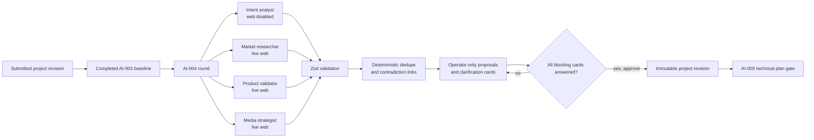

# AI-004 architecture packet — specialized research round trip

Status: implemented and locally verified on 2026-07-20.

## Outcome

AI-004 turns the single Markdown baseline from AI-003 into a controlled second
research round. Four specialized Codex runs receive server-owned, role-specific
context packets. Their final JSON is validated, reconciled deterministically,
shown only to the local operator, and converted into a new immutable project
revision only after explicit human approval.

AI-004 does not create the final architecture/task DAG and cannot start
implementation. Those remain AI-005 responsibilities.

## Flow

## Roles and capability bounds

| Role | Context | Network | Required result |
|---|---|---:|---|
| Intent analyst | current capture only | no | intent, gaps, assumptions, questions |
| Market researcher | capture + AI-003 baseline | live web | source-backed findings and limitations |
| Product validator | capture + AI-003 baseline | live web | risks, experiments and A/B decisions |
| Media strategist | capture + baseline + media filenames | live web | real-media inventory and missing assets |

All roles run in external temporary Git worktrees with read-only sandbox,
`approvalPolicy=never`, hooks disabled by the existing provider adapter, and no
client-supplied prompts, roles, workspace paths or capabilities. Runs are
bounded to two concurrent providers and ten minutes per role.

## Typed output and evidence

Each role must return a `RoleOutput` containing a role identifier, summary,
typed proposals and clarification cards. Proposal types are `finding`,
`suggestion`, `risk`, `media`, `assumption` and `experiment`.

Every evidence entry requires:

- an HTTP(S) source URL;
- ISO retrieval time;
- `summary` or `quote` boundary;
- supporting text;
- low, medium or high confidence.

Quotes longer than 25 words are rejected. Market-research findings without
evidence are rejected. The CLI adapter now writes the server-owned JSON Schema
into the temporary worktree and passes it through `codex exec --output-schema`;
the SDK adapter already forwards the same schema.

## Reconciliation

Reconciliation is application code, not another model turn. Similar proposal
titles and clarification prompts are grouped with normalized token similarity.
The merged proposal retains all contributing roles, distinct evidence, the
highest declared confidence and a duplicate count. Proposals with the same
`decisionKey` and different `stance` values remain separate and link to each
other through `contradictedBy`.

This intentionally avoids a synthesis agent silently deleting disagreement.

## Persistence

Migration 4 adds:

- `research_rounds`: base revision, lifecycle, reconciled JSON, responses and
  approved revision reference;
- `research_role_runs`: one durable status/output reference per specialized
  role.

Validated role output is stored as an immutable `application/json` artifact.
The browser receives normalized typed data; raw provider messages and provider
credentials are not exposed.

If the server restarts during a round, queued/running roles become explicitly
failed and the operator starts a new round. Completed role artifacts remain for
audit, but AI-004 does not resume a partially completed multi-role round.

## Human approval and Project Graph revision

Only the operator route can start or approve a round. Approval validates:

- the current project version;
- the exact round identifier;
- every response card identifier;
- all blocking cards have responses;
- an A/B selection belongs to the card options.

Approval copies the current submitted payload and media links into a new
immutable `project_revisions` row, appends the research decisions, records an
audit event, verifies the public clarification tracker step, and opens the
technical-plan step. Model output never writes canonical project state.

## API and UI

- `GET/POST /api/projects/:projectId/research-round`
- `POST /api/projects/:projectId/research-round/:roundId/approve`

Both are loopback operator-session routes with origin, cookie and CSRF-token
checks plus request-size bounds. The UI shows role status, grouped proposals,
deduplication counts, contradictions, traceable sources, question/A-B cards and
the approved revision receipt. A shared session promise prevents simultaneous
AI-003/AI-004 bootstrap calls from racing the operator cookie.

## Verification

- deterministic merge and contradiction unit coverage;
- integration coverage for four real provider-port calls, capability grants,
  prompt-injection fixture, evidence preservation and approved revision;
- HTTP contract coverage for operator-only start/approve and rejection of
  client-supplied prompts/roles/capabilities;
- Codex CLI output-schema argument coverage;
- owner-local live CLI structured-output proof on a synthetic read-only repo;
- Chromium flow for proposal review, blocking cards and revision approval;
- existing intake, two-way collaboration, mobile tracker and visual tests.

No live four-role Codex research round was run with client data. The automated
provider-port test uses synthetic output; the production adapters are the same
AI-003 adapters already validated against the local Codex login.

## Decisions still needed before client/LAN use

1. Whether raw role summaries remain operator-only permanently or selected
   questions can be explicitly published to the client thread.
2. Whether provider use with real client content requires a per-project consent
   toggle and a redaction preview before starting research.
3. Whether interrupted rounds should retry only failed roles, resume provider
   sessions, or preserve the current explicit full-round retry rule.
4. The monthly/run budget and whether the default `2`-role concurrency should
   be configurable per machine.
5. Whether nonblocking cards may be approved unanswered, as implemented, or
   must be explicitly dismissed with a reason.
