# AI-005 Architecture Packet

Status: implemented vertical slice; verification evidence is recorded in
`GPT/VERIFICATION.md`.

## Outcome

AI-005 converts one approved Project Graph revision into an executable,
digest-bound plan and can carry one task through isolated implementation,
verification, commit and policy-controlled GitHub integration. Provider output
is always a proposal; deterministic services own validation, persistence,
approvals and external effects.

```mermaid
flowchart LR
  Revision["Approved revision"] --> Planner["Planner run · read-only"]
  Planner --> Validator["Schema + DAG validator"]
  Validator --> Review["Operator final review"]
  Review -->|"revision + plan digest + policy"| Packets["Durable task packets"]
  Packets --> Ready["Dependency-ready queue"]
  Ready --> Context["Immutable ContextPacket"]
  Context --> Worker["Worker · external worktree"]
  Worker --> Checks["Scope + secret scan + checks"]
  Checks --> Verifier["Independent read-only verifier"]
  Verifier --> Commit["Isolated branch commit"]
  Commit --> Evidence["EvidenceBundle"]
  Evidence --> Policy["Action policy"]
  Policy -->|"allowed"| GitHub["Push → PR → merge + readback"]
  Policy -->|"approval required"| Operator["Operator action approval"]
  Operator --> Policy
  Policy -->|"unsafe / stale"| Blocked["Blocker inbox"]
```

## Canonical records

| Record | Owner | Immutable binding |
|---|---|---|
| `implementation_plans` | Planning Control | project revision, base commit, plan digest, policy version |
| `plan_approvals` | Operator command | revision + plan digest + policy version |
| `work_items` / dependencies | Work Control | approved plan + canonical task key |
| `context_packets` | Context Compiler | work item + revision + plan + base commit + packet digest |
| `work_attempts` | Work Control | attempt number + lease token + expiry + ContextPacket |
| `evidence_bundles` | Evidence Control | base/current base, diff, commit, checks and review receipts |
| `action_approvals` | Operator command | action kind + exact target + action digest + policy version |
| `integration_runs` | Integration Control | evidence commit + branch + PR + merge readback |

SQLite remains the only operational writer. Git owns code and commits. GitHub
owns remote branches, PRs and merge state. The Artifact Store continues to own
large/raw bytes.

## Plan validation

The provider returns `ImplementationPlan`; the server rejects it when:

- an ID is duplicated or a reference does not resolve;
- a requirement lacks both acceptance coverage and an implementing task;
- a task lacks test, checks, independent review or secret-scan evidence;
- the dependency graph has a cycle or self-dependency;
- two tasks overlap file scopes without bilateral ownership rationale;
- a client step refers to a missing task;
- a blocker remains unresolved.

Approval never accepts a browser-supplied plan. The browser echoes only the
server-computed digest and policy version. A different revision, digest or
policy version invalidates the command.

## Execution contract

1. Work Control selects only `ready` or explicitly retried `failed` work.
2. The repository `HEAD` must equal the plan base commit.
3. Context Compiler persists the packet before any provider call.
4. The attempt receives a 30-minute lease and random fencing token.
5. Workspace Supervisor creates a detached external worktree.
6. The worker receives `workspace-write`, network off, web off, approvals
   `never`; it cannot perform Git or external actions.
7. Control removes the temporary context file and reads the Git file inventory.
8. Forbidden paths and paths outside `fileScopes` block the attempt.
9. The diff is scanned for private keys, provider/Git tokens and secret-shaped
   assignments.
10. Only server-owned `package.json` script names in the task packet run.
11. A second provider call reviews in read-only mode and returns typed findings.
12. Control commits only after all gates pass, creates `aideas/<task-key>` and
    persists EvidenceBundle through a fenced terminal update.

Expired or restarted attempts cannot finalize because the terminal update must
match the original lease token and expected state. Failed worktrees are kept
for diagnosis; successful worktrees are removed through `git worktree remove`
after the branch ref exists.

## Action policy

`aideas-policy-v1` evaluates the exact action target against the approved plan
and latest EvidenceBundle. Git actions require green evidence, unchanged base,
secret scan, tests and independent review. When `approvalRequired=false`,
push/PR/merge may proceed. When true, each action pauses for a matching approval.

Payment, publication and deploy always require distinct approvals. An approval
cannot be reused if the action kind, target, plan digest, commit digest or
policy version changes.

## GitHub integration and readback

- local branch ref must equal the EvidenceBundle commit;
- push is followed by `git ls-remote` SHA readback;
- an existing PR for the branch is reused idempotently;
- merge uses the PR URL and never deletes branches;
- the adapter reads the PR again and requires `MERGED` plus a merge commit;
- `integration_runs` stores waiting approval, PR URL, terminal merge receipt or
  a safe error for explicit retry.

## Operator UI

- architecture component cards and typed edges;
- layered DAG view derived from dependencies, not an illustration;
- digest, policy version, validation report, limitations and blockers;
- task status, dependency status, attempts and EvidenceBundle receipts;
- explicit execute/retry and Git integrate controls;
- exact pending action and approval button when policy pauses;
- only high-level evidence-backed workflow steps enter the client projection.

## Failure and recovery matrix

| Failure | Required result |
|---|---|
| planner output invalid | plan `blocked`; no task materialization |
| project revision or Git base changes | approval/execution rejected as stale |
| worker changes forbidden/out-of-scope file | attempt `blocked`; no commit |
| secret-shaped diff | attempt `blocked`; no EvidenceBundle/commit |
| verification fails | attempt `failed`; worktree/evidence context retained |
| reviewer rejects | attempt `blocked`; findings retained |
| server restarts during attempt | attempt `expired`; old lease cannot finalize |
| duplicate execute request | same idempotency receipt; no second valid attempt |
| Git approval toggle on | integration `waiting_approval` at exact action target |
| remote readback differs | integration `failed`; work item remains verified |
| deploy/publication/payment without approval | policy denies unconditionally |

## Known limits and next gates

- reliability testing currently uses synthetic repositories/adapters; a real
  AIdeas task should be selected by the operator for the pilot acceptance run;
- repair attempts are explicit retries, not an autonomous multi-attempt loop;
- GitHub branch protection/check waiting may require retry after CI becomes
  terminal;
- no deploy, publication or payment adapter is enabled;
- secured LAN, client identity and automatic retention purge remain backlog;
- multi-repository concurrency, PostgreSQL and distributed workflow engines are
  outside this personal single-host slice.
