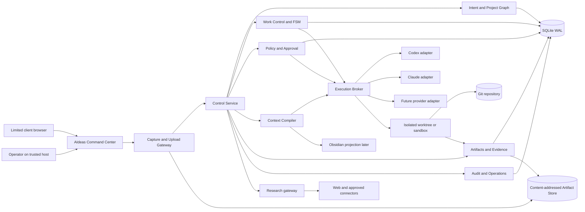

# AIdeas architecture

Status: `v0.3 decision draft`, 2026-07-18. This document owns technical boundaries,
contracts and failure behavior. It implements the canonical Project Forge model
for the AIdeas pilot without activating every future module.

## System map



## Deployment boundary for v1

One trusted host runs the web UI server, Control Service, queue, provider
adapters, workspace manager and SQLite writer. Browser clients can connect from
the host or a secured LAN. They only call authenticated HTTP/event endpoints;
they never see the database file, provider login store, Git credential, raw
process environment or unrestricted filesystem path.

This is a modular monolith for operational simplicity. Module boundaries are
enforced in TypeScript packages/directories and ports, not by deploying many
services prematurely.

## Owner and client intake modes

Both modes use the same validated capture pipeline and canonical data model.
They differ in actor permissions and provider authority, not in storage format.

- **Owner mode:** the operator enters or imports data on the trusted host. Once
  the capture transaction succeeds, policy may enqueue the locally authenticated
  Codex adapter.
- **Client contribution mode:** a limited authenticated browser submits assigned
  cards, Markdown, and media. It cannot access Codex, repositories, execution,
  approvals, database files, or host paths.

Uploads enter quarantine, receive size/type checks and a digest, then move into
the application-owned Artifact Store. SQLite records the manifest, provenance,
links, Project Graph revision, audit, and retention state. Large media bytes are
not stored as SQLite BLOBs. The detailed lifecycle is owned by
`DATA_INGEST_AND_RETENTION.md`.

## Ownership matrix

| Information | Canonical owner | Projection / derived view |
|---|---|---|
| original input | immutable `capture.md` plus artifact manifest | summaries and question context |
| approved requirements, decisions, risks, constraints | versioned Project Graph | readable plan pages, Obsidian notes |
| queue, dependency, lease and attempt status | Work Control | boards and progress rails |
| workflow checkpoint and timers | Runtime FSM | timeline |
| source code and integration history | Git | diffs, indexes and evidence previews |
| client media and run outputs | content-addressed Artifact Store outside Git | thumbnails and downloads |
| approvals | Approval Store bound to digest and policy version | approval inbox |
| human knowledge | explicitly approved knowledge records | search index and Obsidian projection |
| semantic search index | none; rebuildable | retrieval result only |

Agents never write these stores directly. They return typed proposals to domain
command handlers.

## Core modules

| Module | Owns | Important invariant |
|---|---|---|
| Intent Capture | `CaptureEvent`, attachment references, question answers | original input is immutable |
| Project Semantics | nodes, edges, revision, ChangeSet | apply only against expected base revision |
| Work Control | WorkItem, dependency, queue, lease, attempt | expired fencing token cannot complete work |
| Runtime | workflow/step run, checkpoint, retry, cancellation | side-effect boundaries checkpoint before and after |
| Context Compiler | ContextRequest/Packet, source refs, budget | run context is fixed and digestible |
| Execution Broker | provider adapter lifecycle and normalized events | provider output is not canonical state |
| Workspace Manager | branch, worktree, sandbox, command policy | main checkout unchanged before merge gate |
| Policy and Approval | action class, risk, grant, approval | approval cannot be replayed for a different digest |
| Evidence | artifacts, command results, review, bundle | `done` requires valid evidence |
| Operations | audit, health, backup, incident, retention | every mutation and side effect is correlated |

## Minimal data model

Identifiers are opaque UUID/ULID values. Every mutable aggregate has a numeric
version. Timestamps are UTC.

```text
projects(id, name, status, created_at, updated_at, version)
captures(id, project_id, kind, payload_ref, digest, actor_id, created_at)
project_revisions(id, project_id, parent_revision_id, digest, created_at)
semantic_nodes(id, revision_id, type, body_json, source_ref, confidence)
semantic_edges(id, revision_id, from_node_id, to_node_id, type)
change_sets(id, project_id, base_revision_id, proposal_json, status, digest)
work_items(id, project_id, revision_id, type, status, priority, version)
work_dependencies(work_item_id, depends_on_id)
workflow_runs(id, work_item_id, definition_version, status, checkpoint_json)
attempts(id, workflow_run_id, provider, lease_id, fencing_token, status)
context_packets(id, revision_id, base_commit, digest, manifest_json)
approval_requests(id, action_class, subject_digest, policy_version, status)
artifacts(id, digest, media_type, byte_size, storage_key, retention_class,
          retention_due_at, purged_at, created_at)
capture_artifacts(capture_id, artifact_id, purpose, original_name)
evidence_bundles(id, attempt_id, commit_digest, policy_version, manifest_json)
audit_events(id, correlation_id, actor_id, kind, subject_id, payload_json)
outbox(id, topic, payload_json, idempotency_key, delivered_at)
```

The first durable slice implements the subset required for Capture,
ProjectRevision, artifact manifest/link, idempotent command receipt, retention
deadline, and audit. Tables appear when their behavior is tested, not all at
once.

## SQLite rules

- SQLite runs in WAL mode on a local disk controlled by the host.
- One Control Service process owns every write connection.
- Reads use bounded connections and never bypass authorization.
- Commands carry an idempotency key and expected aggregate version.
- A transaction updates domain state, audit record and outbox together.
- Workers cannot write SQLite; they call internal result/heartbeat commands.
- Client and provider processes never open SQLite or choose storage paths.
- Markdown/media bytes live in the Artifact Store; SQLite stores their digest,
  metadata, provenance, link, and lifecycle state.
- Checkpoint/backup is coordinated by the writer; restore ends with
  `PRAGMA integrity_check` and application consistency checks.
- Disk headroom, WAL growth and backup age are health gates.

Migration to PostgreSQL is triggered by more than one trusted writer, more than
one host/runner with sustained mutation, public multi-user tenancy, or recovery
objectives the local process cannot meet. It is not triggered by table count.

## Project Graph contract

The initial graph models only implementation-relevant semantics:

- objective and audience;
- requirements and acceptance criteria;
- constraints and non-goals;
- confirmed decisions and rejected alternatives;
- risks, assumptions and validation experiments;
- components, interfaces and ownership;
- source/evidence references.

A model returns operations such as `add_node`, `update_node`, `add_edge`,
`remove_edge`, and `record_decision`. The command handler validates schema,
references, coverage, authorization and base revision. A successful apply creates
a new immutable revision.

## Provider-neutral execution port

```ts
type ExecutionStart = {
  runId: string;
  workspacePath: string;
  promptRef: string;
  contextDigest: string;
  capabilityGrant: CapabilityGrant;
  timeoutMs: number;
};

type ExecutionEvent =
  | { type: "started"; providerRunId: string }
  | { type: "message"; text: string }
  | { type: "tool"; name: string; status: "started" | "completed" | "failed" }
  | { type: "usage"; input?: number; output?: number; cost?: number }
  | { type: "blocked"; code: string; detail: string }
  | { type: "completed"; resultRef: string }
  | { type: "failed"; code: string; retryable: boolean };

interface ExecutionProvider {
  preflight(): Promise<ProviderHealth>;
  start(input: ExecutionStart): AsyncIterable<ExecutionEvent>;
  cancel(providerRunId: string): Promise<CancelReceipt>;
  inspect(providerRunId: string): Promise<ProviderRunState>;
}
```

Codex and Claude adapters normalize their SDK event streams to this contract.
Provider-specific session IDs and usage remain adapter metadata. The runtime
never lets a provider decide WorkItem or approval status.

## Specialized research/planning roles

The broker uses the minimum useful set for each round. Roles are logical
profiles, not permanently running services.

| Profile | Input | Output |
|---|---|---|
| Intent analyst | captures and current revision | gaps, contradictions, typed questions |
| Market researcher | bounded research questions | source-backed findings and limitations |
| Product validator | problem/audience/options | A/B alternatives and experiments |
| Media strategist | product context and approved assets | media inventory, licensing/format needs |
| Architect | approved semantics and constraints | components, contracts, data/security decisions |
| Planner | architecture and acceptance | dependency DAG and work packets |
| Security reviewer | threat model, diff and grants | findings, required gates and regression tests |
| Execution worker | one work packet and context | isolated changes and raw evidence |
| Independent verifier | diff, tests and acceptance | pass/rework decision with evidence refs |

Profiles cannot delegate new authority. The coordinator grants paths, tools,
network destinations, duration and side-effect classes per attempt.

## Research evidence model

Every material external finding records:

```text
source_url
source_title
publisher/domain
retrieved_at
published_or_effective_at (when known)
jurisdiction (when relevant)
claim_summary
support_level
limitations
revalidation_trigger
content_digest or archived excerpt reference
```

Web and connector content is untrusted data. Instructions inside it never change
capabilities, policies or system prompts. Actions based on external claims must
use the cited source and, where possible, direct readback.

## Approval and evidence gates

An action request contains action class, exact target, subject digest, policy
version, risk reasons and expiration. Approval signs that tuple. Changing the
diff, target, base branch or policy invalidates it.

For autonomous Git integration, evidence minimally includes:

- base commit and resulting commit digest;
- scoped diff and file inventory;
- lint, typecheck, unit/integration/e2e results required by the work packet;
- independent review result;
- secret scan and protected-path policy result;
- current remote/base readback and mergeability;
- push/PR/merge receipt.

Deploy, publication and payment have distinct action classes and cannot inherit
a Git approval.

## API surface for the first durable slice

```text
POST /api/projects
GET  /api/projects/:id
POST /api/projects/:id/captures
POST /api/projects/:id/submission-bundles
POST /api/projects/:id/change-sets
POST /api/change-sets/:id/approve
GET  /api/projects/:id/revisions/:revisionId
POST /api/projects/:id/research-runs
GET  /api/runs/:id/events
POST /api/runs/:id/cancel
POST /api/approval-requests/:id/decisions
```

Requests use CSRF/origin protection, authenticated actor, Zod schemas,
idempotency header and expected-version header where applicable. Error responses
return stable codes and a safe human explanation, never raw provider output or
credentials.

## LAN security

LAN mode is disabled by default. Enabling it requires:

- explicit bind address and allowlist;
- TLS or a trusted encrypted tunnel;
- operator authentication and revocable sessions;
- origin/CSRF enforcement;
- no provider login endpoint exposed to a client role;
- request/body/file limits and malware/content-type checks;
- audit and quick disable switch.

Public internet exposure is not a LAN variant. It starts the multi-user phase
with separate tenancy, identity, billing, secrets manager and threat model.

## Recovery and failure behavior

- provider unavailable/rate-limited: pause or retry with bounded backoff; never
  silently switch billing/provider policy;
- process crash: reconstruct from checkpoint/outbox; replay command idempotently;
- worker timeout: revoke lease; preserve worktree and artifacts for review;
- stale base commit: invalidate evidence and create reconciliation work;
- merge conflict: bounded repair attempt, then unresolved-blocker gate;
- full disk or corrupt database: block new work, preserve evidence, run recovery
  procedure; never delete broad paths automatically;
- projection/index failure: mark lag and rebuild without touching canonical data.

## Scale path

LangGraph may later run cognitive loops inside a bounded AgentTask. It does not
own business lifecycle or approvals. Temporal and PostgreSQL appear only after
distributed durability/concurrency triggers. Plane may be an optional board
adapter; it does not become canonical Work Control.
