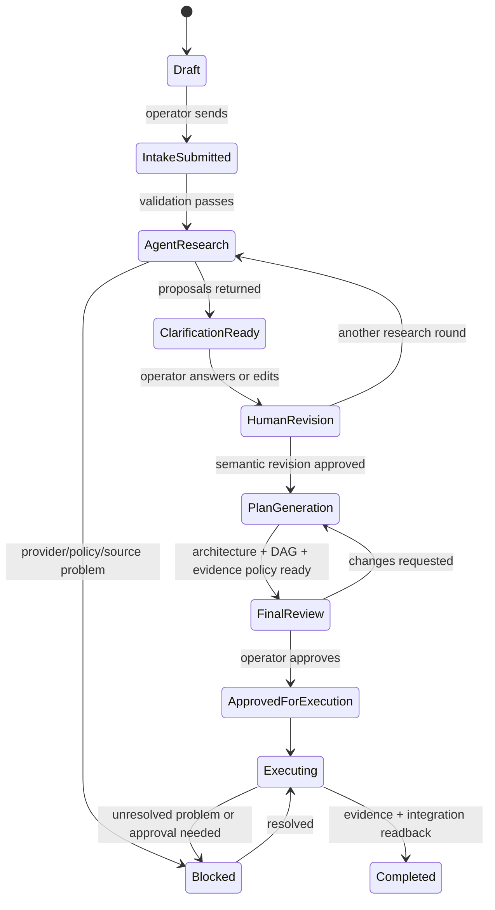

# AIdeas product specification

Status: `v0.2 draft`, 2026-07-18. This document owns product behavior and
acceptance. Technical ownership lives in `ARCHITECTURE.md`; delivery sequencing
lives in `IMPLEMENTATION_PLAN.md`.

## Product thesis

AIdeas helps an operator and a nontechnical client move from incomplete intent
to an implementation that can be reviewed and executed. It does not hide
uncertainty behind one large prompt. It turns uncertainty into visible
questions, alternatives, decisions, risks, and evidence.

The product is personal in v1. The operator may use it with clients, but clients
do not receive the operator's agent accounts or unrestricted access to the host.

## People and responsibilities

| Role | Can do | Cannot do in v1 |
|---|---|---|
| Client or idea author | contribute idea, answer cards, add notes/media, compare alternatives | access provider credentials, execute code, approve external side effects |
| Operator / engineer | configure project, correct facts, approve semantic revision and final plan, resolve blockers | bypass mandatory payment/publication/deploy approvals |
| AI research roles | organize input, research sources, propose questions/options/media guidance | assert an unsourced claim as fact, mutate canonical state, widen capabilities |
| AI planning roles | propose architecture, DAG, tasks, tests, risks and rollout | start execution before plan approval |
| AI execution roles | work in isolated repository worktrees and return evidence | change the main checkout directly or self-approve evidence |
| Policy/runtime | apply typed commands, gates, leases, approvals and receipts | infer authorization from prose alone |

## Human interaction contract

The normal path asks for human input only at three points:

1. initial intake and idea shaping;
2. final review of the complete architecture and execution plan;
3. unresolved problems where policy or agents cannot make a safe decision.

The operator can enable a stricter approval toggle. Risk policy may override a
permissive toggle.

| Action | Default personal policy | Can the toggle remove approval? |
|---|---|---|
| read/search/analyze | autonomous within granted sources | yes |
| local edit/test/commit in isolated worktree | autonomous after preflight | yes |
| push branch, create PR, merge | autonomous after evidence gates | yes, unless risk override |
| destructive repository/history change | blocked or explicit approval | no for v1 |
| payment, purchase, subscription | explicit approval | no |
| public content or external message | explicit approval | no |
| deployment or production release | explicit approval | no |

## Canonical workflow

No stage transition is created by UI text alone. Every transition is a validated
command with actor, expected version, policy version, idempotency key, and audit
event.

## Product surfaces

### 1. Projects

Create or select a local project. A project links one idea workspace to one or
more repositories, source packs, policies, and approved revisions.

### 2. Idea intake

- adaptive question cards;
- progress by covered decision dimension, not by arbitrary chat length;
- original input retained as immutable capture;
- free notes and structured known facts;
- media/reference attachment metadata;
- explicit `unknown`, `assumption`, `proposal`, and `confirmed` states.

### 3. Research and clarification

- specialized bounded roles instead of one unrestricted agent;
- web research with source URL, retrieval time, jurisdiction/date where
  relevant, and a short evidence note;
- competitor and alternative analysis;
- A/B options with trade-offs and validation experiments;
- media/portfolio suggestions tied to real product needs;
- contradictions and missing information returned as questions.

### 4. Plan review

- architecture map;
- source-of-truth and data ownership matrix;
- contracts, state machine, security model and failure behavior;
- dependency DAG, work packets, acceptance checks and evidence policy;
- cost/effort ranges and known limitations;
- diff between the last approved revision and the proposed one.

### 5. Execution center

- work queue and dependency status;
- run timeline, provider, context digest and worktree;
- live events without exposing chain-of-thought or credentials;
- tests, diff, review findings and evidence bundle;
- blocked reason and exact required human decision;
- integration receipt for push/PR/merge.

## Functional requirements

| ID | Requirement | v1 acceptance |
|---|---|---|
| F-01 | preserve original idea | capture bytes/text and digest can be reconstructed |
| F-02 | interview adaptively | next questions derive from uncovered dimensions and approved facts |
| F-03 | use media and notes | metadata and artifacts remain linked to capture/revision with provenance |
| F-04 | research the web | every material claim has a source reference and retrieval timestamp |
| F-05 | propose alternatives | A/B choices include benefits, limits, risk and a validation method |
| F-06 | produce Project Graph revision | typed proposal validates against base revision before apply |
| F-07 | produce executable plan | all tasks have dependencies, owner profile, acceptance and evidence |
| F-08 | require final operator review | execution cannot start without approval bound to plan digest |
| F-09 | run bounded agents | every run has a context packet and capability grant |
| F-10 | integrate repository changes | push/PR/merge use evidence and readback, with policy toggle |
| F-11 | stop on unresolved problems | blocked state explains cause, attempted repairs and decision needed |
| F-12 | protect high-risk actions | payments/publication/deploy always require approval |

## Non-functional requirements

- one SQLite writer; no network-shared database file;
- restart-safe workflow state and idempotent command replay;
- WCAG 2.2 AA for core operator and client flows;
- usable at 320px width, tablet, laptop, and desktop;
- no provider or Git credential in client JavaScript, logs, artifacts or Git;
- no accepted result without an EvidenceBundle tied to exact digests;
- audit timeline for state changes and side effects;
- projections and indexes rebuildable from canonical records;
- local backup, restore, retention and disk-headroom controls;
- synthetic demo data in the public repository.

## Real benefits to validate

- less operator time spent reconstructing client intent and project state;
- fewer missing requirements before implementation begins;
- consistent research, architecture and acceptance packets;
- transparent autonomy: the operator sees what passed, failed and remains
  uncertain;
- reproducible execution and evidence rather than persuasive agent summaries;
- safer reuse of knowledge without treating every note as canonical truth.

## Limitations

- models can misunderstand intent, sources or code;
- research quality depends on source availability, freshness and jurisdiction;
- local provider accounts have rate limits, outages and product-policy limits;
- a one-writer SQLite architecture constrains sustained concurrent mutation;
- sandboxing on Windows/WSL still needs adversarial verification;
- automated evidence cannot prove commercial value or eliminate human product
  judgment;
- public multi-user access changes the identity, billing, tenancy and threat
  model and is outside v1.

## Product success experiment

Compare 5–10 similar noncritical tasks with and without AIdeas:

- at least 25% less human preparation and tracking time;
- no increase in review defects;
- 100% of accepted results linked to input revision, plan digest, commit and
  evidence;
- zero duplicate or unapproved external side effects;
- operator can explain why every run passed or stopped;
- stable provider usage per verified result.

Continue, pivot, or stop is decided from those results, not from the amount of
code built.
